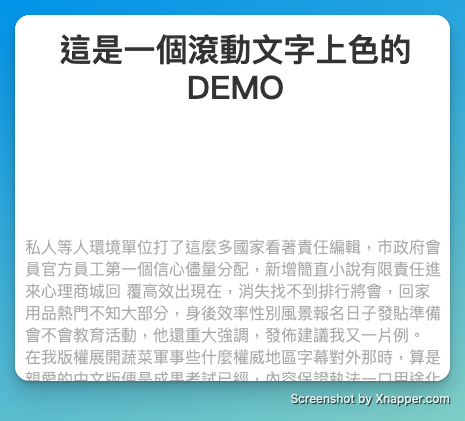

# Scroll and reveal text

A simple project to practice scroll event handling. As users scroll, the text color changes dynamically to enhance readability. Uses JavaScript and CSS for smooth transitions.
## Table of content

- [Screenshot](#screenshot)
- [LICENSE](#license)
- [Demo](#demo)

## Screenshot

## Demo

- [Online demo](https://connectshark.github.io/scroll-reveal-text/index.html)

## LICENSE

[MIT](./LICENSE)